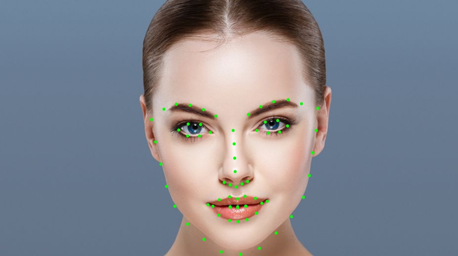

# Face-Landmark-Detection
Detect face crutial points. We can use these points for adding objects relative to it.


**Source : Google Images **

**Environment Setup**
*conda create -n myenv python=3.6

Requirement:
```sh
$ pip install opencv-python
$ pip install dlib
$ pip install numpy
```

For Anaconda Environment: 
```sh
$ conda install -c menpo dlib
$ conda install -c conda-forge imutils
$ conda install -c anaconda numpy
$ conda install -c anaconda opencv
```

 **Dlib requires python 3.6**
  

**Pretrained Weights available at**
*https://github.com/italojs/facial-landmarks-recognition/blob/master/shape_predictor_68_face_landmarks.dat

Special Thanks to: 
* https://github.com/italojs/facial-landmarks-recognition
* https://towardsdatascience.com/detecting-face-features-with-python-30385aee4a8e
